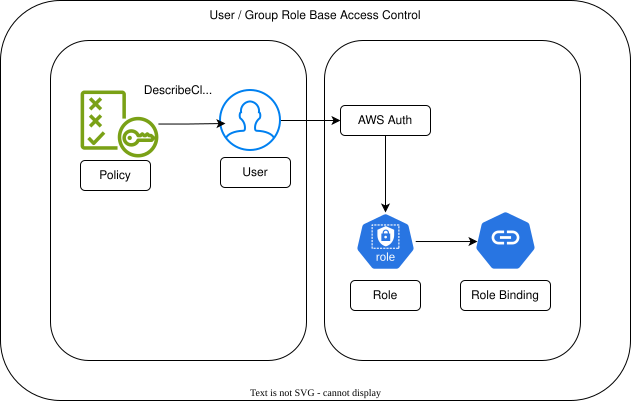

# k8-rbac
Kubernetes Role-Based Access Control


## RBAC



- Kubernetes  is a platform as a service software - PaaS. And it has its own authentication and authorization mechanism.
- RBAC is a method of regulating access to computer or network resources based on the roles of individual users within an enterprise.
- In Kubernetes, RBAC is used to control access to the Kubernetes API and resources.
- RBAC allows you to define roles and permissions for users and groups, and then assign those roles to users or groups.
- This way, you can control who has access to what resources in your Kubernetes cluster.
- RBAC is implemented using Kubernetes API objects such as Role, ClusterRole, RoleBinding, and ClusterRoleBinding.
- Role: A Role defines a set of permissions within a namespace. It can be used to grant access to resources within a specific namespace.
- ClusterRole: A ClusterRole defines a set of permissions that can be applied across the entire cluster. It can be used to grant access to resources across all namespaces.
- RoleBinding: A RoleBinding grants the permissions defined in a Role to a user or group within a specific namespace.
- ClusterRoleBinding: A ClusterRoleBinding grants the permissions defined in a ClusterRole to a user or group across the entire cluster.
- RBAC is an important aspect of Kubernetes security, as it allows you to control access to your cluster and resources, and helps to prevent unauthorized access and potential security breaches.
- RBAC is a powerful tool for managing access to your Kubernetes cluster, and it is essential for maintaining the security and integrity of your cluster.
- RBAC is a critical component of Kubernetes security, and it is important to understand how to use it effectively to protect your cluster and resources.

### Role and Role Binding     -- Trainee 
- Role and Role-Binding are namespace scoped. So, we will create Role and Role Binding in `roboshop` namespace.
- Create policy with `ClusterDescribe` permissions in AWS console.
- Create User from AWS console and assign the above created policy to the user.

```shell
- Create namespace using `kubectl create namespace roboshop`
$ kubectl apply -f 01-role.yaml
$ kubectl get role -n roboshop
NAME           CREATED AT
trainee-role   2026-04-19T04:11:13Z

$ kubectl apply -f 02-role-binding.yaml
$ kubectl get rolebinding -n roboshop
NAME              ROLE                AGE
trainee-binding   Role/trainee-role   10s
```
- Now, create aws-auth configmap in kube-system namespace and add the user ARN to the mapRoles section.
- This can be done by following command:
```shell
$ kubectl get configmap aws-auth -n kube-system -o  yaml                              -> get existing configmap
apiVersion: v1
data:
  mapRoles: |
    - rolearn: arn:aws:iam::<ACCOUNT-ID>:role/eksctl-roboshop-nodegroup-spot-NodeInstanceRole-k1FHX0MGiC44
      groups:
      - system:bootstrappers
      - system:nodes
      username: system:node:{{EC2PrivateDNSName}}
kind: ConfigMap
metadata:
  creationTimestamp: "2026-04-19T03:15:37Z"
  name: aws-auth
  namespace: kube-system
  resourceVersion: "1252"
  uid: fa9bc09e-bd60-4c84-baf4-54ff8bd9cce1

```
- Now add mapUsers section for the user ARN in the above configmap and apply the changes.
```shell
apiVersion: rbac.authorization.k8s.io/v1
kind: RoleBinding
metadata:
  name: trainee-binding
  namespace: roboshop

roleRef:
  apiGroup: rbac.authorization.k8s.io
  kind: Role
  name: trainee-role

subjects:
  - apiGroup: rbac.authorization.k8s.io
    kind: User
    name: ramesh # "name" is case sensitive, and it is created through aws console
    
$ kubectl apply -f 03-aws-auth.yaml
Warning: resource configmaps/aws-auth is missing the kubectl.kubernetes.io/last-applied-configuration annotation which is required by kubectl apply. kubectl apply should only be used on resources created declaratively by either kubectl create --save-config or kubectl apply. The missing annotation will be patched automatically.
configmap/aws-auth configured
```
- Now, ask ramesh to login and verify the access to the cluster using kubectl command.
```shell
Create an Ec2 instance 
Install kubectl
Do aws configure 
$ aws eks update-kubeconfig --name roboshop --region us-east-1
Added new context arn:aws:eks:us-east-1:<ACCOUNT-ID>:cluster/roboshop to /home/ec2-user/.kube/config

$ kubectl get pods                                      -> ramesh does not have access to default namespace
Error from server (Forbidden): pods is forbidden: User "ramesh" cannot list resource "pods" in API group "" in the namespace "default"

13.222.134.210 | 172.31.16.221 | t3.micro | null
[ ec2-user@ip-172-31-16-221 ~ ]$ kubectl get pods -n roboshop   -> ramesh have access to roboshop namespace
No resources found in roboshop namespace.

$ kubectl get deployment -n roboshop                    -> ramesh does not have access to deployments in roboshop namespace
Error from server (Forbidden): deployments.apps is forbidden: User "ramesh" cannot list resource "deployments" in API group "apps" in the namespace "roboshop"
```

### Role and Role Binding     -- Admin
- Can use the same policy with `ClusterDescribe` permissions in AWS console.
- Create User (suresh) from AWS console and assign the above created policy to the user.

```shell
$ kubectl apply -f 04-admin-role.yaml
$ kubectl get role -n roboshop
$ kubectl apply -f 05-admin-role-binding.yaml
$ kubectl get rolebinding -n roboshop

```
- Now, create aws-auth configmap in kube-system namespace and add the user ARN to the mapRoles section.
- Now add mapUsers section for the user ARN in the above configmap and apply the changes.
```shell
apiVersion: v1
kind: ConfigMap
metadata:
  creationTimestamp: "2026-04-19T03:15:37Z"
  name: aws-auth
  namespace: kube-system

data:
  mapRoles: |
    - rolearn: arn:aws:iam::<ACCOUNT-ID>:role/eksctl-roboshop-nodegroup-spot-NodeInstanceRole-k1FHX0MGiC44
      groups:
      - system:bootstrappers
      - system:nodes
      username: system:node:{{EC2PrivateDNSName}}
  mapUsers: |
    - userarn: arn:aws:iam::<ACCOUNT-ID>:user/ramesh
      groups:
      - trainee-binding
      username: ramesh
    - userarn: arn:aws:iam::<ACCOUNT-ID>:user/suresh
      groups:
      - admin-binding
      username: suresh
         
$ kubectl apply -f 03-aws-auth.yaml
Warning: resource configmaps/aws-auth is missing the kubectl.kubernetes.io/last-applied-configuration annotation which is required by kubectl apply. kubectl apply should only be used on resources created declaratively by either kubectl create --save-config or kubectl apply. The missing annotation will be patched automatically.
configmap/aws-auth configured
```
- Now, ask suresh to login and verify the access to the cluster using kubectl command.
```shell
Create an Ec2 instance 
Install kubectl
Do aws configure 

$ aws sts get-caller-identity
{
    "UserId": "AIDAS7GGOGYBHEXOOYDVS",
    "Account": "<ACCOUNT-ID>",
    "Arn": "arn:aws:iam::<ACCOUNT-ID>:user/suresh"
}

$ aws eks update-kubeconfig --name roboshop --region us-east-1
Updated context arn:aws:eks:us-east-1:<ACCOUNT-ID>:cluster/roboshop in /home/ec2-user/.kube/config

$ kubectl get pods -n roboshop                         -> suresh has access to pod
No resources found in roboshop namespace.

$ kubectl get deployments -n roboshop                  -> suresh has access to deployments
No resources found in roboshop namespace.

$ kubectl get pv                                        -> suresh does not have access to peristent volumes at cluster scope
Error from server (Forbidden): persistentvolumes is forbidden: User "suresh" cannot list resource "persistentvolumes" in API group "" at the cluster scope

```


### Cluster-Role and Cluster Role Binding
- Cluster-Role and Cluster Role Binding are cluster scoped.
- Create Cluster Role with `ClusterDescribe` permissions in AWS console.
- Now, provided cluster access to suresh and he can able to view the cluster level resources like pv, nodes, etc.
````shell
apiVersion: rbac.authorization.k8s.io/v1
# This cluster role binding allows anyone in the "manager" group to read secrets in any namespace.
kind: ClusterRoleBinding
metadata:
  name: cluster-role-binding

roleRef:
  kind: ClusterRole
  name: cluster-role
  apiGroup: rbac.authorization.k8s.io

subjects:
  - kind: User
    name: suresh
    apiGroup: rbac.authorization.k8s.io


$ kubectl get pv
No resources found

````

- As the users/employees increase in the organization, it is not a good practice to create individual role bindings for each user.
- So, we can create a group in AWS console and assign the users to that group and then create role binding for that group in Kubernetes.
- This way we can manage the access for multiple users at once by just adding or removing them from the group in AWS console.

- Create role (assume group role) `08-trainee-group-role.yaml`
```shell
# This is just a Role similar to 01-role.yaml, we are giving a name as roboshop-trainee,
# and we are giving access to pods in the roboshop namespace
apiVersion: rbac.authorization.k8s.io/v1
kind: Role
metadata:
  name: trainee-group
  namespace: roboshop

rules:
  - apiGroups: [""] # "" indicates the core API group
    resources: ["pods"]
    verbs: ["get", "watch", "list"]

```

- Create bind the role to a group Binding
```shell
apiVersion: rbac.authorization.k8s.io/v1
kind: RoleBinding
metadata:
  name: trainee-group-role-binding
  namespace: roboshop

roleRef:
  apiGroup: rbac.authorization.k8s.io
  kind: Role
  name: trainee-group

subjects:
  - apiGroup: rbac.authorization.k8s.io
    kind: Group
    name: trainee-group
```

- Now, map the users to the group in aws-auth configmap for users `john` and `rahim`
```shell
apiVersion: v1
kind: ConfigMapAWS policy
metadata:
  creationTimestamp: "2026-04-19T03:15:37Z"
  name: aws-auth
  namespace: kube-system

data:
  mapRoles: |
    - rolearn: arn:aws:iam::<ACCOUNT-ID>:role/eksctl-roboshop-nodegroup-spot-NodeInstanceRole-k1FHX0MGiC44
      groups:
      - system:bootstrappers
      - system:nodes
      username: system:node:{{EC2PrivateDNSName}}
  mapUsers: |
    - userarn: arn:aws:iam::<ACCOUNT-ID>:user/ramesh
      groups:
      - trainee-binding
      username: ramesh
    - userarn: arn:aws:iam::<ACCOUNT-ID>:user/suresh
      groups:
      - admin-binding
      username: suresh
    - userarn: arn:aws:iam::<ACCOUNT-ID>:user/john
      groups:
      - trainee-group
      username: john
    - userarn: arn:aws:iam::<ACCOUNT-ID>:user/rahim
      groups:
      - trainee-group
      username: rahim
```

# Service Account
- With the above user / group rbac process, we can provide access to the users to access the k8 resources.
- But these user accounts can't be used in the application process to access any resources.
- Users can be resign and there accounts can be deactivated and it will impact the application process if we are using those user accounts in the application process.
- To avoid this issue, Kubernetes provides a special type of account called `Service Account`.
- A `Service Account` is a special type of account that is used to provide an identity for processes that run in a Pod.
- It is used to authenticate and authorize the processes running in the Pod to access the Kubernetes API and other resources in the cluster.
- A Service Account is created in a specific namespace and can be used by any Pod in that namespace.
- A Service Account is associated with a set of credentials, which are stored in a Secret.

## Steps
1. Create Service Account
2. Create IAM role and attach permissions to the role
3. Run POD with the Service Account
4. We need OIDC (OpenIDConnect) provider to be enabled in the cluster to use IAM roles for Service Accounts (IRSA) in EKS.
5. This allows the Service Account to assume the IAM role and access AWS resources securely without needing to manage long-term credentials.

## Create OIDC provider
```shell
$ eksctl utils associate-iam-oidc-provider --region us-east-1 --cluster roboshop --approve
2026-04-19 06:27:12 [ℹ]  will create IAM Open ID Connect provider for cluster "roboshop" in "us-east-1"
2026-04-19 06:27:12 [✔]  created IAM Open ID Connect provider for cluster "roboshop" in "us-east-1"
```

## Create Service Account
```shell
$ eksctl create iamserviceaccount \
  --name roboshop-secret-reader \
  --namespace roboshop \
  --cluster roboshop \
  --attach-policy-arn arn:aws:iam::<ACCOUNT-ID>:policy/roboshop-dev-reader \
  --approve
  
2026-04-19 06:39:49 [ℹ]  1 iamserviceaccount (roboshop/roboshop-secret-reader) was included (based on the include/exclude rules)
2026-04-19 06:39:49 [!]  serviceaccounts that exist in Kubernetes will be excluded, use --override-existing-serviceaccounts to override
2026-04-19 06:39:49 [ℹ]  1 task: {
    2 sequential sub-tasks: {
        create IAM role for serviceaccount "roboshop/roboshop-secret-reader",
        create serviceaccount "roboshop/roboshop-secret-reader",
    } }2026-04-19 06:39:49 [ℹ]  building iamserviceaccount stack "eksctl-roboshop-addon-iamserviceaccount-roboshop-roboshop-secret-reader"
2026-04-19 06:39:49 [ℹ]  deploying stack "eksctl-roboshop-addon-iamserviceaccount-roboshop-roboshop-secret-reader"
2026-04-19 06:39:49 [ℹ]  waiting for CloudFormation stack "eksctl-roboshop-addon-iamserviceaccount-roboshop-roboshop-secret-reader"
2026-04-19 06:40:19 [ℹ]  waiting for CloudFormation stack "eksctl-roboshop-addon-iamserviceaccount-roboshop-roboshop-secret-reader"
2026-04-19 06:40:19 [ℹ]  created serviceaccount "roboshop/roboshop-secret-reader"


Note:
Here, 
role-name will atomatically created, but we need to specify the permissions in the IAM policy and attach that policy to the role.
Hence, create a ploicy with required permissions in AWS console and attach that policy to the role which is created by the above command.
(I want to read the secrets manager value)
```

```shell
$ kubectl get sa -n roboshop
NAME                     SECRETS   AGE
default                  0         150m
roboshop-secret-reader   0         54s


```

